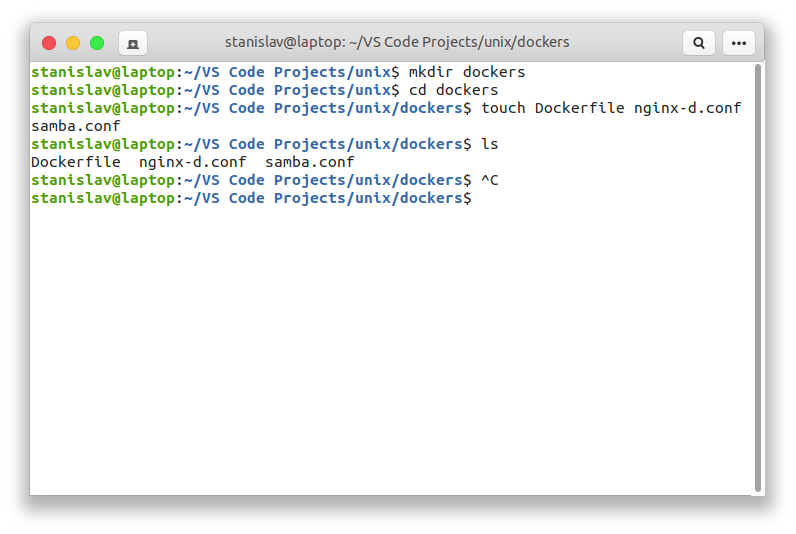
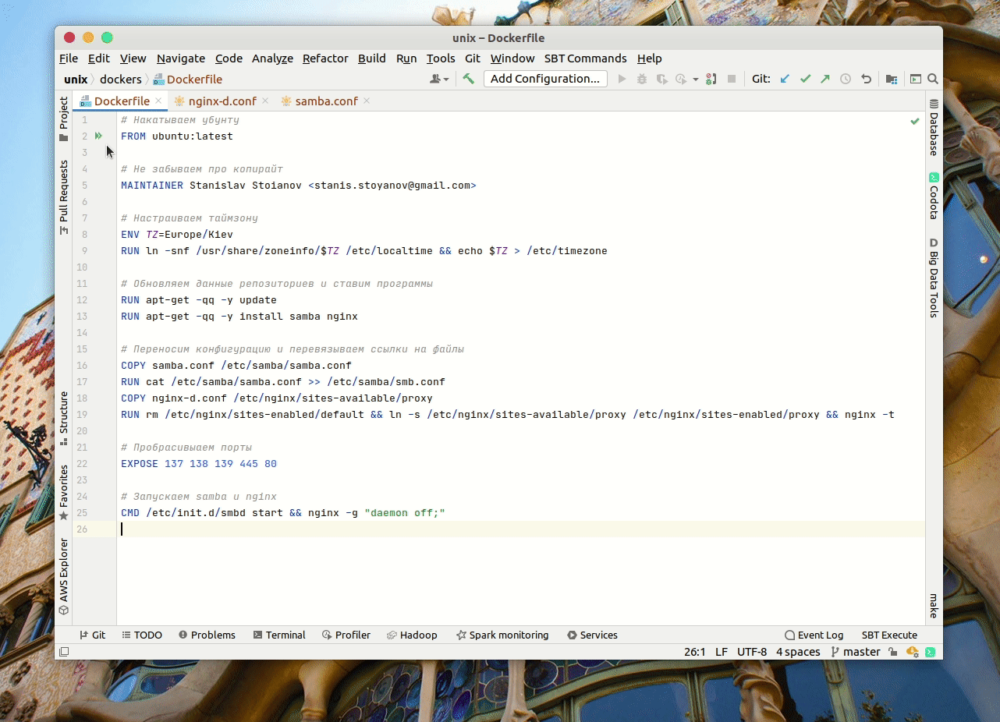
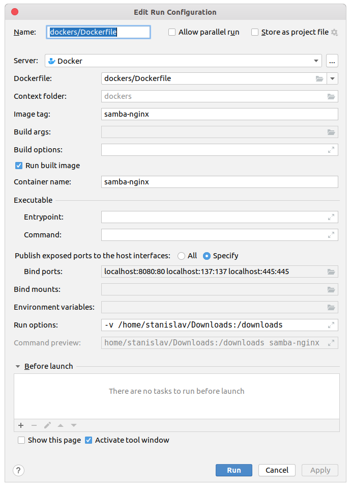
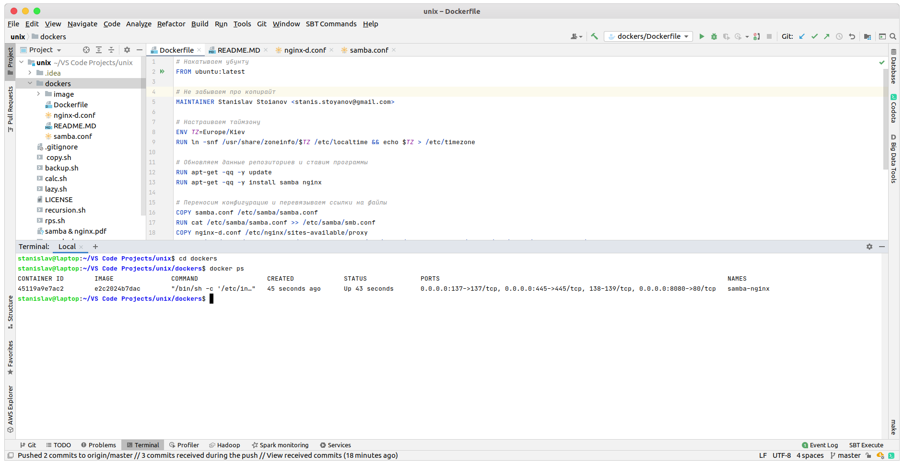
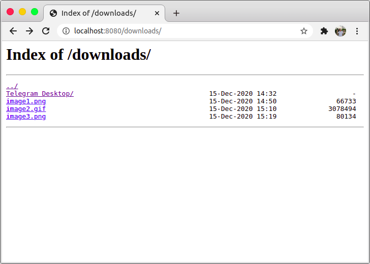
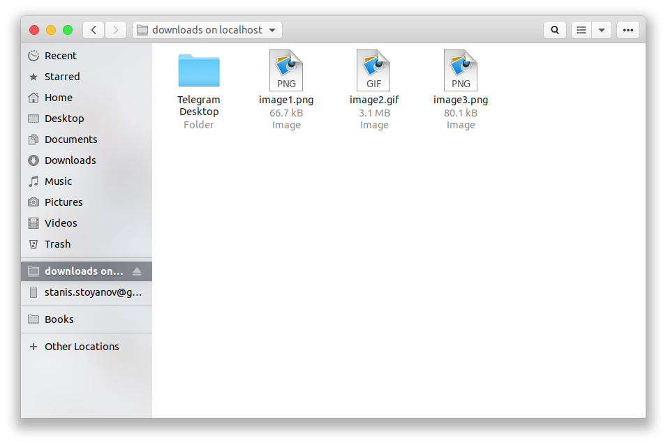

Докер в системе у меня уже стоит с давних-давних пор для запуска Apache Kafka и Apache Zookeeper, поэтому процесс установки я уже подробно не распишу - для этого есть [документация](https://docs.docker.com/engine/install/ubuntu/). Работа ведется на Ubuntu 20.04 LTS

1. Для начала создаем рабочую папку и файлы в специальной папке с домашками по никсам



#### Далее для упрощения работы я буду использовать IntelliJ IDEA с плагином для работы с докер файлами


2. Напишем в Dockerfile следующий код

```
# Накатываем убунту
FROM ubuntu:latest

# Не забываем про копирайт
MAINTAINER Stanislav Stoianov <stanis.stoyanov@gmail.com>

# Настраиваем таймзону
ENV TZ=Europe/Kiev
RUN ln -snf /usr/share/zoneinfo/$TZ /etc/localtime && echo $TZ > /etc/timezone

# Обновляем данные репозиториев и ставим программы
RUN apt-get -qq -y update
RUN apt-get -qq -y install samba nginx

# Переносим конфигурацию и перевязываем ссылки на файлы
COPY samba.conf /etc/samba/samba.conf
RUN cat /etc/samba/samba.conf >> /etc/samba/smb.conf
COPY nginx-d.conf /etc/nginx/sites-available/proxy
RUN rm /etc/nginx/sites-enabled/default && ln -s /etc/nginx/sites-available/proxy /etc/nginx/sites-enabled/proxy && nginx -t

# Пробрасивыаем порты
EXPOSE 137 445 80

# Запускаем samba и nginx
CMD /etc/init.d/smbd start && nginx -g "daemon off;"

```

Конечно же нам нужна кастомная конфигурация для nginx и samba. Она почти идентична конфигурации с прошлой домашки

Для samba - лежит в файле samba.conf
```
[downloads]
  directory mask = 777
  create mask = 777
  path = /downloads
  guest ok = yes
  guest only = yes
  public = yes
```
Для Nginx - лежит в файле nginx-d.conf
```
server {
   listen 80;
   server_name proxy;
   location /downloads {
       alias /downloads/;
       autoindex on;
   }
}
```

Создаем новую конфигурацию для запуска Dockerfile



По итогу наша конфигурация для запуска будет выглядеть вот так - настроил проброшенные порты и доступ к файлу за пределами докера



Запустим билд и проверим успешность сборки


Проверим контейнер через консоль - контейнер живой и работает



Проверим доступ в браузере - nginx открывается по нужному пути



Проверим доступ через проводник - самба перенаправляет доступ к папке


